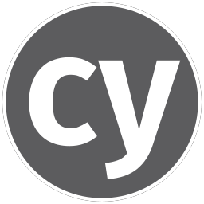

# 👋 Hey, I'm Ben!

A computer science sophomore at [National University of Singapore](https://www.nus.edu.sg/) passionate about designing and building applications that improve the lives of people! Some technologies I enjoy working include NextJS, ReactJS, Redux, NodeJS, and Figma (UI/UX Design). Most recently, I had the chance to work on an [exhibition site](https://www.nusmarchgradshow.com/2022) for the NUS Masters of Architecture Graduation Show 2022.

## Languages and Technologies 🌱

  
  &nbsp;
  
  &nbsp;
  
  &nbsp;
  
  &nbsp;
  
  &nbsp;
  
  &nbsp;
  
  &nbsp;
  
  &nbsp;
  
  &nbsp;
</a>

## Learn more about me! :zap:

<ul>
  <li>:bread: More about me: <a href="https://www.sbhbenjamin.works" title="portfolio">sbhbenjamin.works</a>
  </li>
  <li>:postbox: Connect with me: <a href="https://www.linkedin.com/in/sbhbenjamin" title="linkedin">LinkedIn</a>
  </li>
</ul>

<!--
**sbhbenjamin/sbhbenjamin** is a ✨ _special_ ✨ repository because its `README.md` (this file) appears on your GitHub profile.

Here are some ideas to get you started:

- 🔭 I’m currently working on ...
- 🌱 I’m currently learning ...
- 👯 I’m looking to collaborate on ...
- 🤔 I’m looking for help with ...
- 💬 Ask me about ...
- 📫 How to reach me: ...
- 😄 Pronouns: ...
- ⚡ Fun fact: ...
-->
